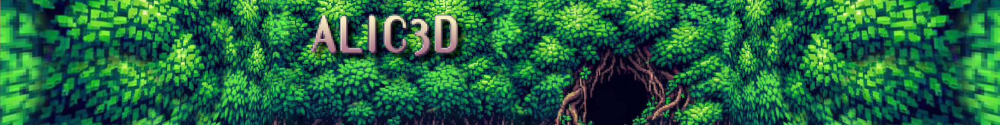
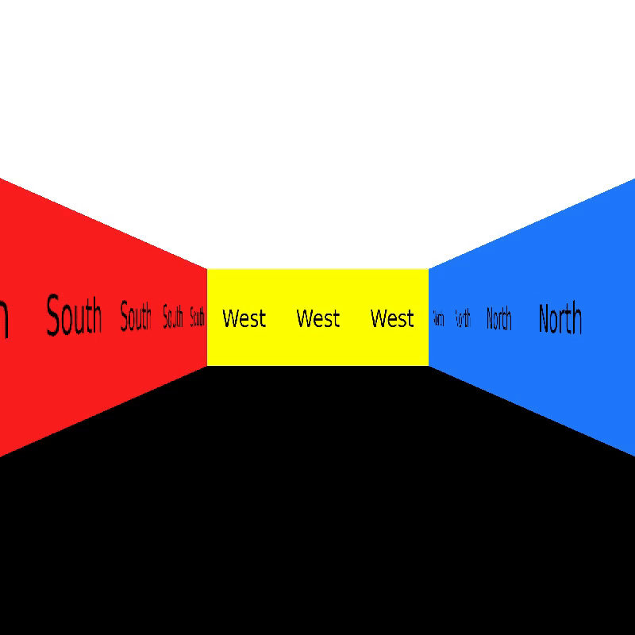

# cub3D  
*Raycaster en C — moteur graphique temps réel, miniLibX, illusion 3D from scratch.*
<p align="center">
  
</p>

---

## cub3D ?

cub3D est un projet graphique du **Common Core de l’École 42**, souvent résumé un peu vite comme  
« un Wolfenstein-like ».

En pratique, c’est surtout un **premier vrai moteur temps réel**, écrit en C, sans moteur externe, sans abstraction confortable, et sans droit à l’approximation.

Le projet consiste à afficher une **vue 3D dynamique d’un labyrinthe**, à partir d’une simple map 2D, en utilisant le **ray-casting**.  
Chaque image affichée à l’écran est le résultat de calculs géométriques effectués à la main, pour chaque colonne de pixels.

Pas de magie.  
Pas de moteur 3D.  
Juste des maths, des pixels, et des choix techniques qui se voient immédiatement.

---

## Intention du projet

cub3D n’est pas un projet de rendu “joli”.  
C’est un projet de **compréhension**.

L’objectif est de comprendre :
- comment une **caméra** perçoit un monde
- comment une **distance** devient une hauteur de mur
- comment une **illusion de profondeur** est fabriquée en 2D
- comment maintenir une **boucle de rendu stable** en temps réel

À la moindre approximation :
- l’image tremble
- les murs respirent
- la perspective s’effondre

cub3D est un projet qui force à être rigoureux, ou à regarder son moteur se désintégrer visuellement.

---
## Partie mandatory — Le socle du moteur

<p align="center">
  
</p>
Cette séquence montre la partie obligatoire du projet, telle qu’attendue par le sujet, sans aucun bonus.

Elle comprend :
- un ray-casting fonctionnel
- une navigation fluide (déplacements + rotations)
- des murs texturés selon leur orientation
- un rendu stable, sans artefacts

un parsing strict et sécurisé du fichier .cub

C’est la fondation technique du moteur.
Et soyons honnêtes : c’est fonctionnel, mais c’est moche.

Il était donc hors de question de rendre un projet visuellement pauvre, sans âme ni intention.
Nous avons donc largement investi la partie bonus, en allant parfois bien au-delà de ce qui était proposé par le sujet.

---

## Mon rôle & approche


cub3D est un **projet réalisé en duo**, mais j’ai abordé mon travail avec une contrainte claire :  
penser ce projet comme **un vrai jeu**, pas comme une simple réponse au sujet.

Mon implication couvre notamment :
- implémentation complète du **ray-casting**
- gestion du **point de vue**, des rotations et des déplacements
- gestion des **textures directionnelles** (N / S / E / W)
- mise en place d’une **boucle de rendu temps réel stable**
- gestion propre des erreurs et de la mémoire
- création de l’ensemble des assets visuels (textures, sprites, direction artistique)

---

## Bonus implémentés

<p align="center">
  
</p>

Au-delà de la partie mandatory, j’ai développé plusieurs fonctionnalités avancées, certaines allant plus loin que les bonus explicitement demandés par le sujet :
- collisions murales précises
- portes interactives
- sprites animés
- rotation du point de vue à la souris

Bonus Persos :
- crouch (variation dynamique de la hauteur de caméra)
- animations et comportements liés au gameplay

Ces ajouts ont nécessité des ajustements fins du moteur :
recalculs de projection, gestion des collisions, et maintien d’un rendu fluide malgré des contraintes supplémentaires.

---

## Ray-casting — Le cœur du moteur

<p align="center">
  
</p>

Le principe du ray-casting est simple sur le papier :
- le joueur a une position et une direction
- pour chaque colonne de l’écran, on lance un rayon
- le rayon avance dans la map jusqu’à toucher un mur
- la distance détermine la hauteur du mur affiché

Dans les faits, tout est dans les détails :
- gestion des angles
- précision des distances
- correction de la perspective
- distinction des faces touchées

Chaque colonne de pixels est le résultat d’un calcul indépendant.  
Une erreur mathématique se voit immédiatement à l’écran.

---

## Parsing — Le fichier `.cub` comme contrat

<p align="center">
  
</p>

La scène est décrite par un fichier `.cub` contenant :
- les chemins vers les textures murales
- les couleurs du sol et du plafond
- la map 2D
- la position et l’orientation initiale du joueur

Contraintes fortes :
- une seule position de départ valide
- map obligatoirement fermée
- gestion des espaces, lignes vides, ordres variables
- **sortie propre avec message explicite au moindre problème**

Le parsing est volontairement strict.  
Un moteur instable commence presque toujours par une entrée mal contrôlée.

---

## Déplacements & perception

<p align="center">
  
</p>

Le joueur peut :
- avancer / reculer
- se déplacer latéralement
- tourner la caméra

Chaque mouvement impacte :
- l’angle de projection
- la direction des rayons
- la lisibilité de l’espace

Le ressenti est un test permanent :  
si la navigation est inconfortable, c’est qu’il y a une erreur quelque part.

---

## Bonus — Fonctionnalités avancées

Les maps principales du projet utilisent la **version bonus** du moteur, incluant notamment :

- collisions murales
- mini-map
- gestion plus avancée des déplacements
- extensions de la logique de parsing

Ces fonctionnalités ne sont évaluées **que si la partie mandatory est parfaite**, ce qui impose une base moteur extrêmement propre.

---

## Lancer le projet correctement

Les maps principales utilisent la version **bonus**.

Compilation :
```bash
make bonus
```

Lancement avec les maps de test :
```bash
./cub3D maps/level1_bonus.cub maps/level2_bonus.cub
```

---

## Tech stack

- Langage : C
- Librairie graphique : miniLibX
- Rendu : Ray-casting
- Parsing : fichier `.cub`
- Architecture : moteur temps réel from scratch
- Contraintes : norme 42, zéro fuite mémoire

---

## Ce que montre cub3D

cub3D démontre :
- une compréhension concrète des **moteurs graphiques bas niveau**
- l’application directe de **mathématiques à un problème visuel**
- la capacité à maintenir une **boucle temps réel stable**
- une approche rigoureuse du **C**, sans bricolage
- la transformation d’un sujet académique en **objet technique cohérent**

---

### Contributeur

<table align="center">
  <tr>
    <td align="center">
      <a href="https://github.com/BBoroboro"><strong>MathieuMoulin</strong></a>
    </td>
  </tr>
  <tr>
    <td align="center">
      <a href="https://github.com/BBoroboro">
        
      </a>
    </td>
  </tr>
</table>
